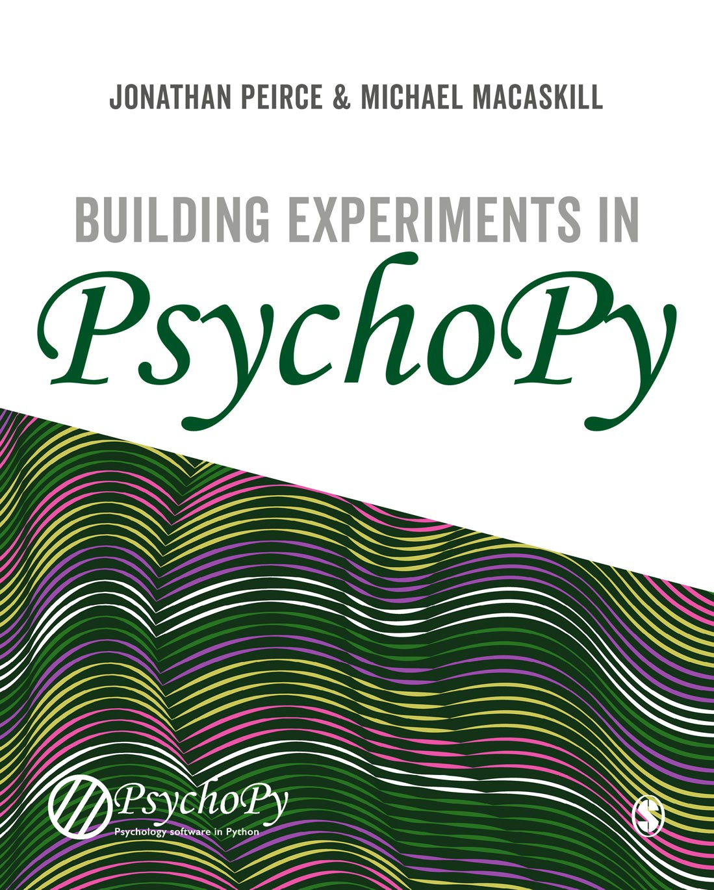

# Building Experiments in PsychoPy (materials)

This repository contains the materials that go with the [the book Building Experiments in PsychoPy][bookURL] (Peirce and MacAskill, Sage Publishing). The examples here are organised by chapter number. To make sense of the materials you might want to buy that book! ;-)

**To download the full set of files** go to the button "Clone or Download" on the top right of the page. If you don't know about using git version control then you probably want to "Download the zip" file. Then, make sure you unzip the folder before trying to load the experiment, however. On Windows double-clicking on a zip file will allow you to look inside without "extracting" the files and that won't be sufficient in this case.

All the materials in this repository are free for you to use and re-use, although some materials have further licenses inside the relevant folder.

[bookURL]: https://uk.sagepub.com/en-gb/eur/building-experiments-in-psychopy/book253480
